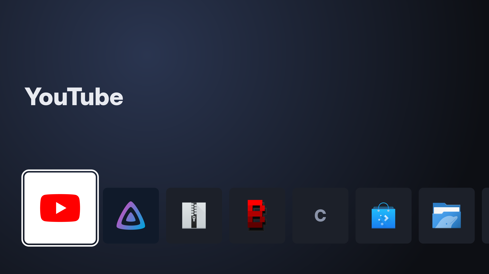
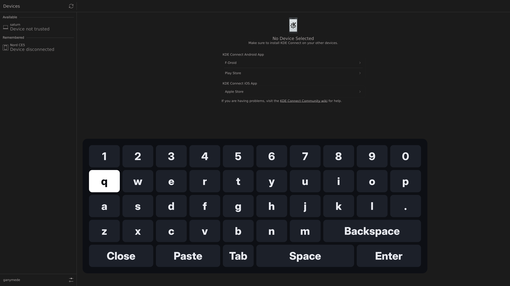

# emrakul

A Wayland compositor that turns a PC plugged into a TV into an appliance: one
fullscreen thing on screen at a time, driven from the couch. Built on
[Smithay](https://github.com/Smithay/smithay), in one crate, configured by one
TOML file.

Its first home is `ganymede`, a GTX 1050 Ti laptop on an LG OLED. Games are
streamed in from a desktop over Moonlight, so emrakul is not a gaming
compositor. It is a TV shell that happens to be able to show a game stream.

## Status

**M0, pixels on the TV: done.** On ganymede, emrakul sets 3840x2160@60 on the
NVIDIA card, renders with GLES on that same card, and shows the newest client
fullscreen. mpv plays a 60 fps test pattern there at a measured 60.0003 Hz with
0 dropped and 0 mistimed frames.

What it does today:

- Opens one configured DRM card and connector, and sets the configured mode or
  the display's preferred one.
- Lists every app (installed desktop entries from `XDG_DATA_HOME` and
  `XDG_DATA_DIRS`) on Home, most recently launched first. Apps never launched
  follow: entries with any `X-Emrakul-*` key (the ones nixconf declares for
  the TV) first, then the rest, each A to Z. Entries marked `Hidden`,
  `NoDisplay` or `OnlyShowIn` aren't apps. The order lives in
  `$XDG_STATE_HOME/emrakul/recent`, so it survives restarts.
- Draws Home as the webOS ribbon: the focused app's name large over a dark
  backdrop, and one row of tiles along the bottom that scrolls once four
  tiles are left of the focus. Each tile is the entry's `Icon=` (hicolor's
  scalable SVG, else its largest PNG, else `pixmaps`; the first letter of
  its name if there is none) centred on its `X-Emrakul-Brand=#rrggbb`
  colour, or dark grey. Focus starts on the app just quit. Home only
  redraws when focus moves: one frame per press, 20 to 30 ms to render on
  ganymede, and nothing while it sits there.
  
- Runs one app at a time. Going Home asks it to close (`xdg_toplevel.close`,
  or the entry's `X-Emrakul-Quit` command if it has one), then sends its
  process group SIGTERM after 5 s and SIGKILL 5 s after that. Whenever the
  app's process exits, however it exits, Home comes back.
- Shows exactly one toplevel, fullscreen and with no decorations. The newest
  one wins, and closing it brings back the one before.
- Tells clients the output's `scale` (`wl_output.scale` and
  `preferred_buffer_scale`), and sizes the fullscreen toplevel to the mode
  divided by it: 1920x1080 on the 4K TV at 2, so Chromium lays a page out at
  1920 CSS pixels wide and draws it at full 4K. Home, the on-screen keyboard
  and the cursor are emrakul's own and stay in screen pixels at any scale.
  The pointer lives in client (logical) pixels, so a click lands on what
  the client drew under the arrow's tip.
- Speaks enough Wayland for real clients: shm, dmabuf with per-surface scanout
  feedback, presentation-time, viewporter, xdg-output, cursor-shape, and xdg
  popups, so a web app's `<select>` dropdowns and context menus show above
  it, kept on the screen. They close when their app leaves the screen or on
  a click outside them.
- Reserves Ctrl+Alt+Backspace (quit), Ctrl+Alt+F1–F12 (switch VT) and
  Ctrl+Alt+H (go Home, the keyboard's Steam button). Every other key goes
  to the foreground client, except on Home itself, where arrows move the focus
  and Enter launches.
- Reads gamepads (the Steam Controller through the kernel's `hid-steam`
  driver, Linux 7.3+) straight from their evdev nodes, following udev as they
  come and go with the wireless link, and grabs them (`EVIOCGRAB`) so no
  client reads them too: Jellyfin's own Gamepad API code would otherwise see
  every press twice. Games will release the grab for Moonlight once they
  exist. The Steam button (`BTN_MODE`) goes Home from anywhere. Everything
  else becomes keys on the seat keyboard and a pointer, one map for every
  web app:

  | Control | Becomes |
  | --- | --- |
  | D-pad, left stick past half way | arrows, repeating while held |
  | A | Enter |
  | B | Alt+Left (back) |
  | RB / LB | Tab / Shift+Tab, repeating while held |
  | X | left click, where the pointer is |
  | Y | k |
  | LT / RT, full pull | j / l (YouTube: back / forward 10 s) |
  | View | Escape |
  | R5 / L5 (lower grips) | zoom in / out (Ctrl+= / Ctrl+-) |
  | Right trackpad, its click | pointer, left button |
  | Left trackpad | scroll, wheel-style (finger up scrolls up) |
  | Menu | the on-screen keyboard, in an app |
  | Analog triggers, stick clicks, right stick, grips, Quick access | nothing yet |

  Web apps are driven by keyboard focus: the bumpers move it, A
  activates it. Home reads the same arrows and Enter: they move the focus
  and launch. The cursor is emrakul's own arrow, drawn at TV size; Chromium asks for it by
  name over `wp_cursor_shape_v1` and hides it over a playing video. It
  appears in the middle of the screen at the first touch of the right
  trackpad and hides again when the app changes. A swipe across the whole
  trackpad moves the pointer the width of the screen.
- Draws its own on-screen keyboard over a running app when Menu is
  pressed, so a search box can be filled from the couch: digits, lowercase
  letters, `.`, Backspace, Tab, Space, Enter and Close, on keys styled like
  Home's tiles, along the bottom of the screen. The D-pad or stick moves
  the white focus (no repeat while held), A types the focused key into the
  app through the seat keyboard, as if typed on a real one, and B is
  Backspace. Menu again, or its Close key, closes it; Steam still goes Home.
  While it is open, nothing else on the controller reaches the app, and
  the trackpads do nothing. It opens with the focus on q.
  
- Blanks the screen (DPMS off) after `idle_timeout` with no activity, 10
  minutes unless configured. The TV shows No Signal and may power itself
  down. Activity is a controller button, a stick past a quarter of its
  travel, a trigger pulled a quarter of the way, a trackpad touch, a
  controller connecting, or a key press. The input that wakes the screen
  does nothing else, so a press you couldn't see launches nothing. A client
  holding `zwp_idle_inhibit` (Chromium while a video plays) holds blanking
  off. The countdown restarts when the last inhibitor goes, and a client that
  dies holding one releases it. While blank, clients get no frame callbacks.
  Games don't hold the screen on: their Moonlight must run with
  `--no-keep-awake`, which never asks for an inhibit. Moonlight reads the
  controller itself, so a press that wakes the screen during a Game still
  reaches the game.

- Holds the TV's own settings (picture mode, Just Scan, energy saving) to
  what is on screen, over the LG's network API (SSAP), when `[tv]` is
  configured. Home, apps, and apps whose entry names a profile
  (`X-Emrakul-Tv=game`) each get their own settings, layered over ones that
  always hold. It reads each setting and only writes the ones that differ,
  the picture mode first, since picture settings belong to a mode. It
  checks again every 15 s, so a TV switched on later or changed with its
  remote is put back. It touches nothing while the TV shows another input,
  because the settings belong to whichever input is on screen. A setting
  the TV refuses gets a warning, once. An off TV costs nothing: the TV is
  talked to from a thread of its own.

ganymede's cutover is in nixconf ([dd6eb8a](https://github.com/cramt/nixconf/commit/dd6eb8a)), waiting on a deploy:
emrakul is its only session, and Home lists three web apps, YouTube,
Nebula and Jellyfin, each Chromium with the VA-API flags below and its own
profile under `~/.local/state/web-apps`. Plasma, SDDM and Steam are gone.
Next: game entries over Moonlight.

## Configuration

```toml
# A by-path name: cardN numbering follows probe order and can swap between boots.
device = "/dev/dri/by-path/pci-0000:01:00.0-card"
connector = "HDMI-A-1"
mode = "3840x2160@60"   # optional; omitted = the display's preferred mode
launch = ["foot"]       # optional; started once the compositor is up, outside
                        # the app lifecycle (a test hook)
idle_timeout = 600      # optional; seconds without activity before the
                        # screen blanks, default 600
scale = 2               # optional; output scale clients draw at, default 1

# Optional. Without it the TV's settings are left alone.
[tv]
host = "192.168.178.36"
key_file = "/run/secrets/tv-key"  # an SSAP client key; ganymede's was paired by bscpylgtv
cert_fingerprint = "11:C5:B1:…"   # SHA-256 of the TV's cert; every connection is pinned to it
input = "HDMI_1"                  # the TV input this machine is on

[tv.settings.aspectRatio]        # always held
justScan = "on"
arcPerApp = "original"

[tv.home.picture]                # on Home
pictureMode = "filmMaker"

[tv.app.picture]                 # in an app whose entry names no profile
pictureMode = "filmMaker"

[tv.profiles.game.picture]       # in an app with X-Emrakul-Tv=game
pictureMode = "game"
```

Settings are the TV's `settings/getSystemSettings` categories and keys.
`tv get-setting picture pictureMode` and `tv set-setting …` from
[webos-ssap](https://github.com/cramt/webos-ssap) are for finding values by
hand. Values are strings or integers, as the TV reports them.

Run it with `emrakul --config config.toml` inside a logind session that owns
the seat. On NixOS, use the module:

```nix
services.emrakul = {
  enable = true;
  user = "cramt";
  settings = {
    device = "/dev/dri/by-path/pci-0000:01:00.0-card";
    connector = "HDMI-A-1";
    mode = "3840x2160@60";
  };
};
```

The module runs emrakul as a system service on a VT, with a PAM login session,
and switches that VT's getty off. It refuses to evaluate alongside a display
manager, because whichever starts second gets no DRM master and shows a black
screen. It also sets `hid_steam lizard_mode=0`, without which the
gamepad node stays silent, and takes the Steam Controller's hidraw nodes
away from the seat's user, since anything opening one makes `hid-steam`
unregister the gamepad.

## Development

```sh
nix develop -c cargo test
nix develop -c cargo clippy --all-targets -- -D warnings
nix build
```

`RUST_LOG=emrakul=debug` logs which plane each frame went out on, and why the
foreground surface was or wasn't scanned out directly. Add `emrakul=trace` for
every redraw transition.

`EMRAKUL_DUMP_HOME=/var/tmp/home.png` writes every frame with Home or the
on-screen keyboard in it to that file as a PNG, rendered offscreen from the
same elements the screen gets, for seeing them without being in front of the
TV. It costs about 300 ms a frame at 4K.

`EMRAKUL_DUMP_FRAME=/var/tmp/frame.png` writes the next frame, whatever is
on screen, to that file if it isn't there yet. Delete it to get another.

## Hardware notes: ganymede (GTX 1050 Ti, nvidia 580)

- **TV EDID.** The LG only advertises HDMI 2.x (4K60, HDR10, VRR) once *HDMI
  Deep Colour* is enabled for its input. Before that, it reports 4K30 at most.
- **No VRR.** The TV advertises 40–120 Hz VRR, but the connector reports
  `vrr_capable = 0`. NVIDIA only does HDMI VRR on Turing and newer.
- **No overlay planes.** Smithay's reference compositor disables them on
  NVIDIA because using one breaks the output, and emrakul does the same. The
  primary plane is still available for direct scanout.
- **Direct scanout doesn't happen with mpv**, so frames are composited, which
  holds 4K60 without drops. mpv's Vulkan path allocates compressed
  block-linear buffers (modifier `0x0300000000cdb014`: kind `0xdb`,
  compression 1). The primary plane only accepts uncompressed kind `0xfe`
  (`0x03000000004fe010`–`…015`), and nvidia-drm refuses them in `addfb2`
  ("Invalid format modifier for framebuffer object"). The scanout tranche in
  the dmabuf feedback only lists the plane's modifiers, but NVIDIA's Vulkan
  WSI allocates compressed buffers anyway. mpv's OpenGL path is never even
  offered for scanout. Revisit if a client or driver update starts honouring
  the scanout tranche.
- **4K60 YouTube decodes on the card.** Chromium 154 with nvidia-vaapi-driver
  0.0.18 decodes 4K60 VP9 on NVDEC under emrakul: `VaapiVideoDecoder`, about
  26% decoder load, 23% CPU, 0–1.6% dropped frames. It needs
  `LIBVA_DRIVER_NAME=nvidia` and `--enable-features=AcceleratedVideoDecodeLinuxGL,VaapiOnNvidiaGPUs
  --ignore-gpu-blocklist --use-gl=angle --use-angle=gl`. Without those flags
  Chromium decodes in software (`VpxVideoDecoder`): it still reaches 60 fps,
  but at 77% CPU and 2–3% dropped frames. Measurements are in
  [#14](https://github.com/cramt/emrakul/issues/14).
- **Steam Controller on 7.3.** hid-steam binds the puck (`28de:1304`) and the
  NVIDIA driver loads on 7.3-rc4. The gamepad node only exists while the
  controller is awake, anything opening the puck's hidraw unregisters it, and
  with `lizard_mode=0` every control arrives on the gamepad (Steam is
  `BTN_MODE`). Full map: [docs/hardware/steam-controller-7.3.md](docs/hardware/steam-controller-7.3.md).
- **TV settings over SSAP (webOS 9.2.4, OLED65B46LA).** Writes need LG
  Remote App's signed manifest at registration. Without it every
  `setSystemSettings` is a 401, `WRITE_SETTINGS` or not. `pictureMode`
  takes `filmMaker`, `game`, `eco` and the like, and reads back. An unknown
  value is a 500 that changes nothing. `aspectRatio` can be written but
  never read. `energySaving` isn't per picture mode: it stays put when the
  mode changes. `getSystemSettings` with several keys fails if any one is
  unknown, so emrakul reads one at a time. Run
  `cargo test real_tv -- --ignored` with `EMRAKUL_TV_*` set (see
  `src/tv.rs`) to check against the real TV.
- The Smithay rev is pinned to the one niri 26.04 ships, because that build was
  seen driving this exact TV before emrakul existed.
